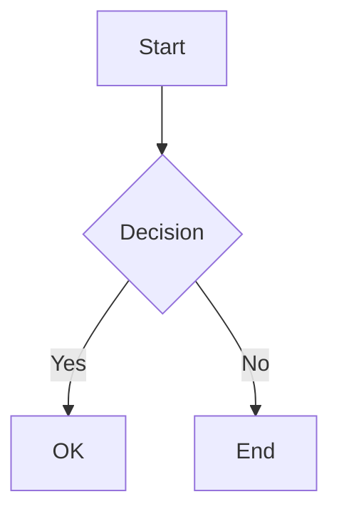
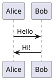

> 提示：笔记内容请用中文撰写，模板中的英文仅为格式示例。

# Subject Title

Use H1 for the subject/module.  → generated as a *concept* card.

## Topic Name

H2 splits into sections — each H2 becomes 1–3 flashcards.

Key idea: everything under an H2 until the next heading is sent to AI
as one chunk.  Keep each section focused.

### Subtopic (optional)

H3 works the same way, nested under the parent H2.

- Bullet lists are good for listing related facts
- AI will turn them into cards

> Blockquotes can highlight key points or definitions.

---

## Adding Media

### Images

Inline images just work:

        <!-- file relative to src/ -->

### LaTeX Formulas

Use `$$` for display math:

$$
E = mc^2
$$

And `$` for inline: $ax^2 + bx + c = 0$

### Code Blocks

Standard code blocks become *code* cards — front shows snippet, back shows
output and explanation.

```python
def greet(name):
    return f"Hello, {name}"

print(greet("World"))
```

### Diagrams (Mermaid)

Mermaid fenced blocks become rendered SVGs in Anki.



### Diagrams (PlantUML)



---

## How Sections Map to Cards

| Section type | Card type(s) produced |
|---|---|
| Plain explanation (no code/formula) | concept |
| Vocabulary / term | word |
| Formula + derivation steps | math |
| Code snippet | code |
| Sentence with `{{c1::gap}}` | cloze |
| Mermaid / PlantUML / SVG | diagram |
