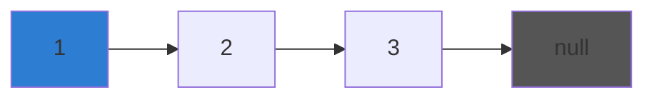

> 提示：笔记内容请用中文撰写，模板中的英文仅为格式示例。

# Data Structures

## Array

A contiguous block of memory holding elements of the same type.
Indexed by position (0-based in most languages).

| Operation | Time complexity |
|---|---|
| Access by index | O(1) |
| Search (unsorted) | O(n) |
| Insert at end (amortized) | O(1) |
| Insert at middle | O(n) |

### Common methods (JavaScript)

```javascript
const arr = [1, 2, 3, 4, 5];
arr.push(6);        // → [1,2,3,4,5,6]
arr.pop();          // → [1,2,3,4,5]
arr.map(x => x*2);  // → [2,4,6,8,10]
arr.filter(x => x % 2 === 0); // → [2,4]
```

**Output prediction**: what does `arr.map(x => x*2).filter(x => x > 5)` return?

## Big O Notation

### Common complexities

$$
O(1) < O(\log n) < O(n) < O(n \log n) < O(n^2) < O(2^n)
$$

**Derivation**: count how many times the dominant operation runs
as input size $n$ grows.

```python
# O(n) — linear scan
def find_max(arr):
    max_val = arr[0]
    for x in arr:         # runs n times
        if x > max_val:
            max_val = x
    return max_val
```

Output of `find_max([3, 7, 2, 9, 1])` → `9`

---

## Linked List

### Reversal algorithm



Reverse by reassigning each node's `next` pointer to the previous node.
Three pointers: `prev`, `current`, `next`.

```python
def reverse(head):
    prev = None
    curr = head
    while curr:
        next_node = curr.next
        curr.next = prev
        prev = curr
        curr = next_node
    return prev
```

When `curr` reaches `null`, `prev` is the new head.
