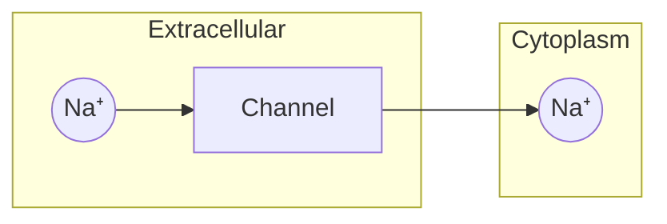

> 提示：笔记内容请用中文撰写，模板中的英文仅为格式示例。

# Cell Biology

## Cell Membrane

The cell membrane is a phospholipid bilayer that:
- Separates the cell interior from the environment
- Controls what enters and exits (semi-permeable)
- Contains embedded proteins for transport and signaling

### Structure

The {{c1::phospholipid bilayer}} consists of {{c2::hydrophilic heads}} facing outward
and {{c2::hydrophobic tails}} facing inward.

### Transport mechanisms

| Type | Energy? | Example |
|---|---|---|
| Simple diffusion | No | O₂, CO₂ |
| Facilitated diffusion | No | Glucose via carrier protein |
| Active transport | Yes (ATP) | Na⁺/K⁺ pump |

---

## Photosynthesis

$$
6CO_2 + 6H_2O \xrightarrow{light} C_6H_{12}O_6 + 6O_2
$$

### Stages

1. **Light-dependent reactions** (thylakoid membrane)
   - Input: light, H₂O, NADP⁺, ADP
   - Output: O₂, ATP, NADPH

2. **Calvin cycle** (stroma)
   - Input: CO₂, ATP, NADPH
   - Output: glucose (C₆H₁₂O₆), ADP, NADP⁺

### Key Concept

The {{c1::Calvin cycle}} is also called the {{c2::light-independent reactions}}
because it {{c3::does not require direct light}}.
