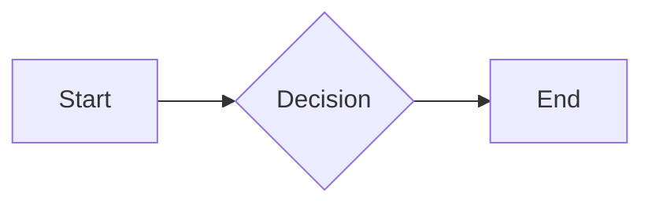

# Calculus Review

## Derivatives

The derivative of a function f(x) at point x is defined as:

$$f'(x) = \lim_{h \to 0} \frac{f(x+h) - f(x)}{h}$$

Key rules:
- Power rule: d/dx (x^n) = n * x^(n-1)
- Product rule: (fg)' = f'g + fg'

### Example

Find the derivative of f(x) = 3x^2 + 2x

```python
def derivative():
    return 6*x + 2
```

## Integrals

The definite integral represents the area under a curve.



## Linear Algebra

### Matrix Multiplication

For matrices A (m×n) and B (n×p), the product C = AB is defined as:

C_ij = sum of A_ik * B_kj for k = 1 to n
